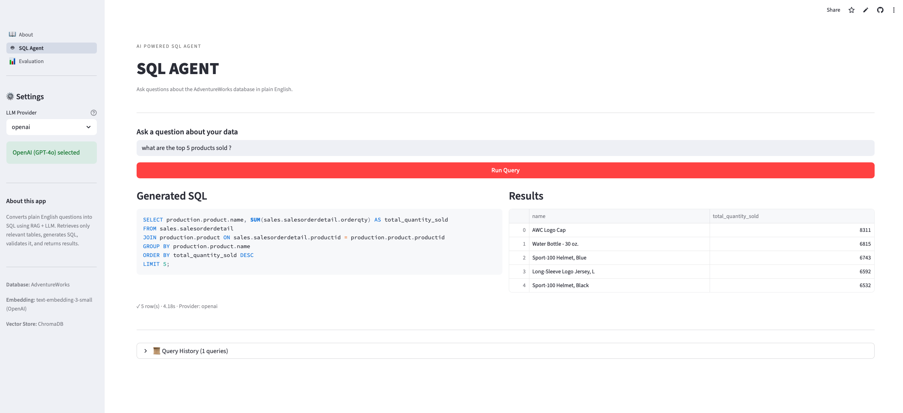
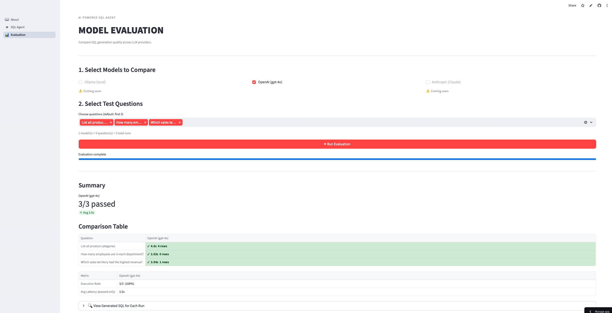
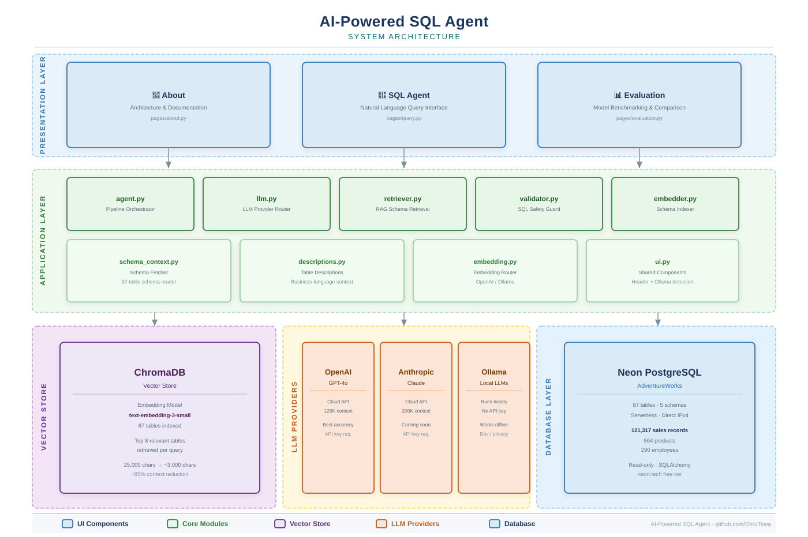
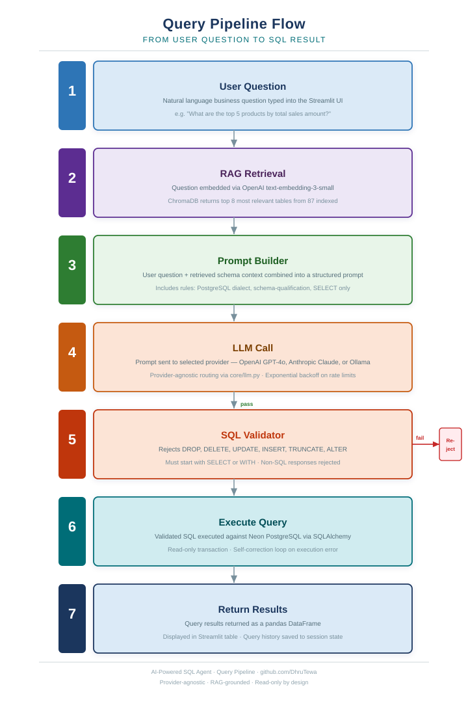

<div align="center">

# AI-Powered SQL Agent

### Ask your database questions in plain English. Get answers as tables.

[](https://python.org)
[](https://openai.com)
[](https://anthropic.com)
[](https://neon.tech)
[](https://ai-powered-sql-agent.streamlit.app)
[](LICENSE)

**[🚀 Live Demo →  https://ai-powered-sql-agent.streamlit.app](https://ai-powered-sql-agent.streamlit.app)**

</div>

---

## What It Does

This agent converts plain-English business questions into validated, executable SQL queries against the **AdventureWorks** database — an 87-table, 5-schema PostgreSQL dataset covering sales, products, employees and purchasing.

Type a question. The agent retrieves only the relevant tables using **RAG**, generates optimised SQL via an **LLM**, validates it for safety, executes it, and returns results — all in seconds.

> *"What are the top 5 products by total sales amount?"*
> → Retrieves 8 relevant tables → Generates JOIN query → Executes → Returns ranked table

---

## Live Demo





---

## System Architecture



---

## Query Pipeline



---

## Tech Stack

<div align="center">

**Language & Runtime**


**AI & LLMs**


**Data & Infrastructure**


**Frontend & Deployment**


</div>

---

## How It Evolved

| Phase | What Was Built | Key Addition |
|---|---|---|
| **1 — Foundation** | Single script: question → SQL → result | End-to-end pipeline, Ollama LLM, local PostgreSQL |
| **2 — Structure** | Python package (`core/`), safety layer | Multi-provider LLM routing, SQL validator, self-correction loop |
| **3 — Intelligence** | RAG with ChromaDB | Schema retrieved per question — 25K chars reduced to ~3K |
| **4 — Production** | Streamlit app, cloud deployment | 3-page UI, Neon cloud DB, Streamlit Cloud deployment |

---

## RAG — Why It Matters

AdventureWorks has 87 tables across 5 schemas. Sending all of them on every query wastes tokens and reduces accuracy — the LLM must sift through 25,000 characters to find what it needs.

**RAG solves this in two phases:**

**Indexing (once):** Each table is embedded with a business-language description using `text-embedding-3-small` and stored in ChromaDB:
```
Schema: sales · Table: salesorderdetail
Description: Individual product line items on sales orders including
             product, quantity, unit price and discount
```

**Retrieval (per query):** The question is embedded and the 8 most similar tables are returned — reducing prompt context by ~85% and improving accuracy.

---

## SQL Safety Layer

Every generated query passes through a validator before execution:

- Rejects `DROP`, `DELETE`, `UPDATE`, `INSERT`, `TRUNCATE`, `ALTER`
- Rejects responses that are not a `SELECT` or `WITH` statement
- Catches LLM refusals before they reach the database
- Self-correction loop: on execution failure, sends the error back to the LLM for one retry

---

## Project Structure

```
core/
├── agent.py          — pipeline orchestrator: schema → prompt → LLM → SQL → result
├── embedding.py      — embedding routing: OpenAI or Ollama
├── embedder.py       — one-time ChromaDB indexer
├── descriptions.py   — business-language descriptions for all 87 tables
├── llm.py            — LLM routing: OpenAI / Anthropic / Ollama
├── retriever.py      — RAG retrieval: question → top 8 relevant tables
├── schema_context.py — AdventureWorks schema fetcher
├── ui.py             — shared header + Ollama availability detection
└── validator.py      — SQL safety guard

pages/
├── about.py          — project overview, architecture, tech stack
├── query.py          — main SQL agent interface
└── evaluation.py     — side-by-side model benchmarking

docker/               — Docker setup (Phase 4c)
docs/                 — SVG architecture diagrams, screenshots, PowerPoint
app.py                — Streamlit page router
main.py               — CLI entry point: python main.py "your question"
explore_db.py         — database schema explorer utility
chroma_db/            — ChromaDB vector store (pre-indexed, 87 tables)
```

---

<div align="center">
Built by <a href="https://github.com/DhruTewa">Dhruv Tewari</a> · AdventureWorks Database · Powered by OpenAI + ChromaDB + Neon
</div>
